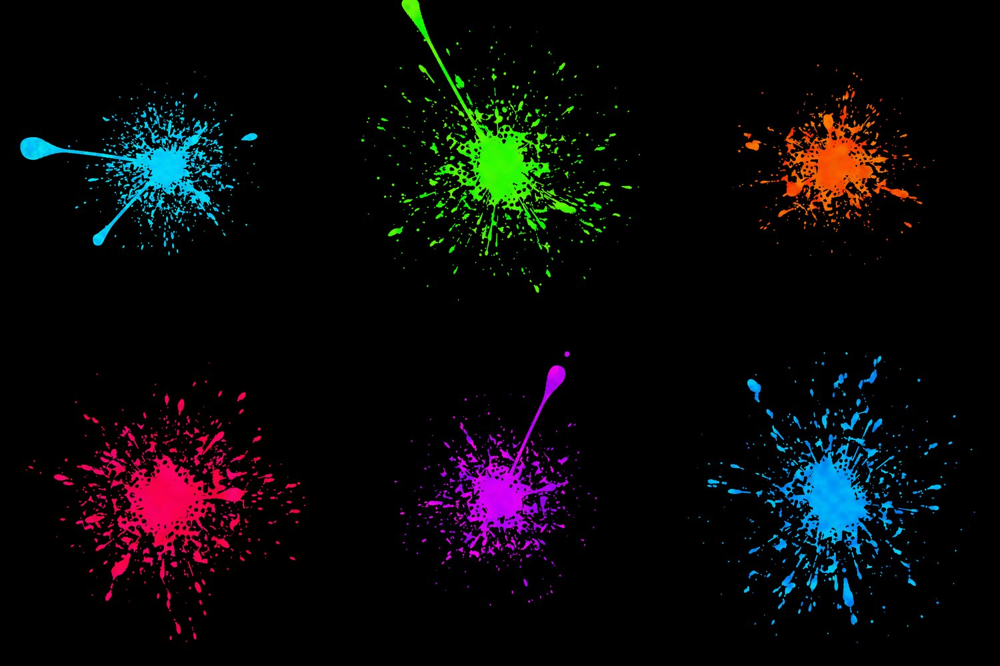
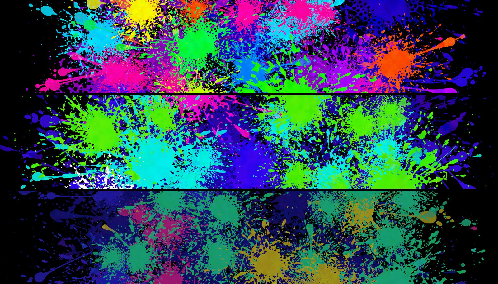
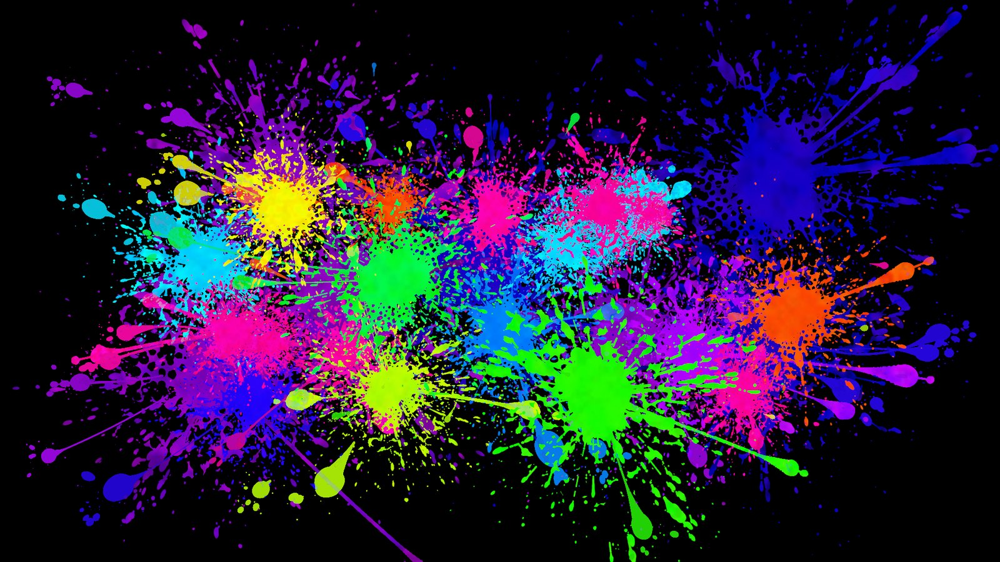
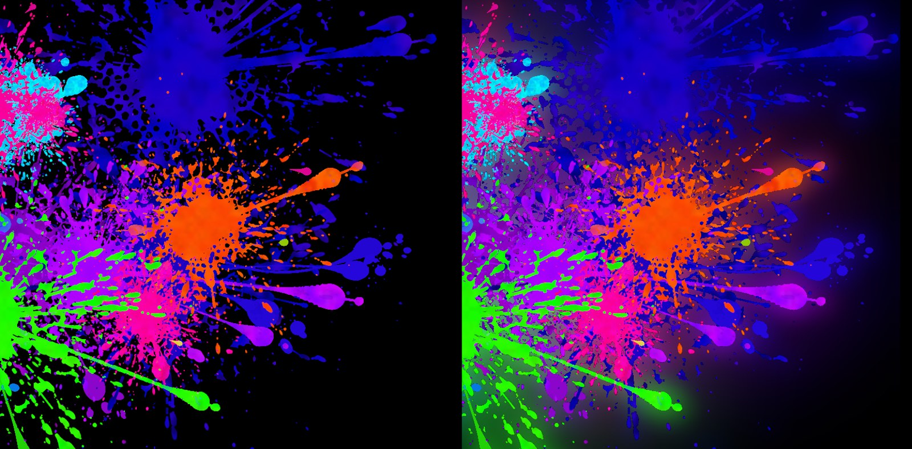
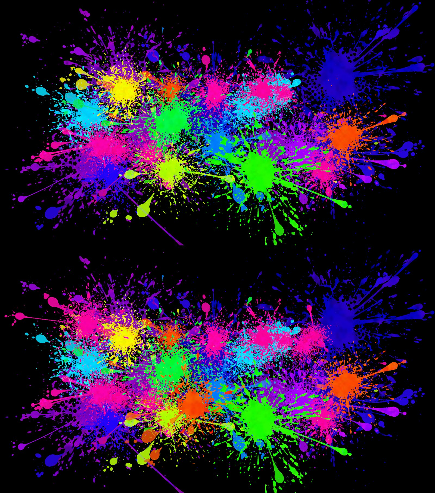

# Open Splatter

Seed based splatter generation for Unity. For menu backgrounds, loading screens and UI decoration.



We needed a splatter generator for our game and couldn't find one that fit, so here it is if anyone else needs it =)

## Terms

- **Splat**: one blob of paint. Core, arms, drops, threads, spray.
- **Seed**: the same seed always gives the same splat.
- **Composition**: a full picture, made of many splats.
- **Palette**: the colours a composition draws from. Rainbow, Cool and Muted are included.
- **Canvas**: the texture you paint on. A `RenderTexture`, so it goes straight onto a `RawImage` or a material.



## Install

Unity 2022.3 or newer. No render pipeline dependency.

Package Manager, *Add package from git URL*:

```
https://github.com/cover-up/open-splatter.git
```

Or in `Packages/manifest.json`:

```json
"com.coverup.splatter": "https://github.com/cover-up/open-splatter.git"
```

## Quick start

```csharp
using CoverUp.Splatter;

var composition = SplatComposition.Generate(seed: 7, SplatPalette.Rainbow, 1920, 1080);
var canvas = new SplatCanvas(1920, 1080);
canvas.Begin(composition);
canvas.PaintAll();

rawImage.texture = canvas.Texture;
```

`Dispose()` the canvas when you're done with the texture.



## Painting gradually

`PaintAll` does it in one frame. `PaintNext` does one item per call:

```csharp
void Update()
{
    if (!canvas.Done) canvas.PaintNext();
}
```

`Done` goes true when there's nothing left.

## Single splats

No composition needed. `SplatRules.Generate` takes:

- `seed`, picks the look
- `rcFramePx`, core radius in the rules' reference frame (a picture 1672 px wide)
- `scale`, screen pixels per reference pixel
- a `hue` from 0 to 360, or a palette to pick the colour

```csharp
var recipe = SplatRules.Generate(seed: 3, rcFramePx: 40f, scale: 1.5f, hue: 200f);
var themed = SplatRules.Generate(seed: 4, rcFramePx: 40f, scale: 1.5f, SplatPalette.Cool);
```

Onto a canvas you already have, position in canvas pixels, y up:

```csharp
canvas.Paint(recipe, x: 300f, y: 200f);
```

Or onto its own transparent texture:

```csharp
var single = SplatCanvas.RenderSingle(themed, out Vector2 centre);
```

`Generate` is plain C# and never touches the GPU. Safe on a worker thread.

## Colours

`SplatPalette` sets the hues, the saturation and brightness, and the chance of a white splat. Presets hand back a fresh copy, so edit the fields freely:

```csharp
var palette = SplatPalette.Cool;
palette.VMul = 0.8f;          // darker
palette.WhiteChance = 0f;     // never a white splat

SplatPalette.Presets;         // all three, for a dropdown
SplatPalette.ByName("Muted");
```

## Glow

`SplatGlow` haloes the paint in each splat's own colour, in the empty space only. Separate texture, so display that instead of the canvas:

```csharp
var glow = new SplatGlow(1920, 1080) { Strength = 0.5f, Radius = 40f * composition.Scale };
rawImage.texture = glow.Texture;

void LateUpdate() { glow.Render(canvas); }
```

`Render` skips frames where the paint didn't change.



## Adjusting the look

Every part of a splat has a named rule with a range. `SplatRuleOverrides` changes the ranges without editing the package:

```csharp
var rules = new SplatRuleOverrides()
    .Scale(SplatRules.DropsN, 1.5f)          // half again as many drops
    .Set(SplatRules.WebReach, 1.8f, 2.2f)    // arms that don't reach as far
    .Set(SplatRules.SprayN, 0f);             // no spray

var composition = SplatComposition.Generate(seed, SplatPalette.Cool, 1920, 1080, rules);
```

Full list in [SplatRules.cs](Runtime/SplatRules.cs), commented.

Three settings sit on the canvas instead:

- `Gain` multiplies paint colour on the way in. Above 1 it goes past white, which bloom picks up.
- `SprayOnPaint`, the chance spray sticks when it lands on paint.
- `ChainOnPaint`, how opaque a thread is over paint.

A composition brings its own values for the last two.

## Changing a picture on screen

A composition is a list of items in paint order. Add and cut after painting:

```csharp
var group = composition.PreparePush(rng);        // pick one more splat
composition.ApplyPush(group);                    // add it to the list
canvas.PaintNext();                              // paints only what's new

composition.PopOldest();                         // drop the oldest group
composition.AddSplat(recipe, x, y, hole: true);  // erase a splat shape instead of painting it
```

`PreparePush` only reads the cores, so it runs on a worker thread while the main thread paints.

The canvas can't remove paint. After `PopOldest`, build a second canvas from the shorter list and crossfade. The Living Backdrop sample does this.

A hole erases to the background. Later splats see it as empty canvas, and the glow leaves it dark.



## Trying it out

**Living Backdrop sample**, under the package's Samples tab. One component, full-screen backdrop that keeps changing.

***Window > Open Splatter > Render Preview***. PNGs without play mode: a composition per palette, one with glow, a strip of single splats, a picture after a few changes.

## How it works

Splats are lumpy discs and wavering capsules with a colour field over the top. Around sixty rules give the numbers: how far the arms reach, how many drops and how their sizes fall off, how long the threads run and where they thin to a line, how dense the spray is and where it peaks.

Each rule has a measured value and a range. A seed draws once from every range, and that draw is the splat's character, so two seeds differ in kind and not just in noise.

The values were measured off reference paintings and stored in units of the core radius, so a splat holds up at any size.

Compositions are the same idea one level up. Large dark splats go down first as a bed. Then 13 to 20 front splats, placed by a separation rule inside a band of the frame, hues by area quota from the palette, so every picture lands on similar proportions and no two touching splats share a hue. Throws radiate from the frame centre, small drops fill the gaps, fixed paint order throughout.

## Files

| Path | What it does |
| --- | --- |
| `Runtime/SplatRules.cs` | The rules, the recipe and the generator. Plain C#. |
| `Runtime/SplatPalette.cs` | The colour themes. Plain C#. |
| `Runtime/SplatComposition.cs` | Layout, plus add, remove and hole. Plain C#. |
| `Runtime/SplatCanvas.cs` + `Runtime/Shaders/SplatPaint.shader` | The painter. |
| `Runtime/SplatGlow.cs` + `Runtime/Shaders/SplatGlow.shader` | The glow pass. |
| `Editor/SplatterPreview.cs` | The preview window. |
| `Samples~/Backdrop/` | The Living Backdrop sample. |

## Licence

MIT, see [LICENSE](LICENSE).
