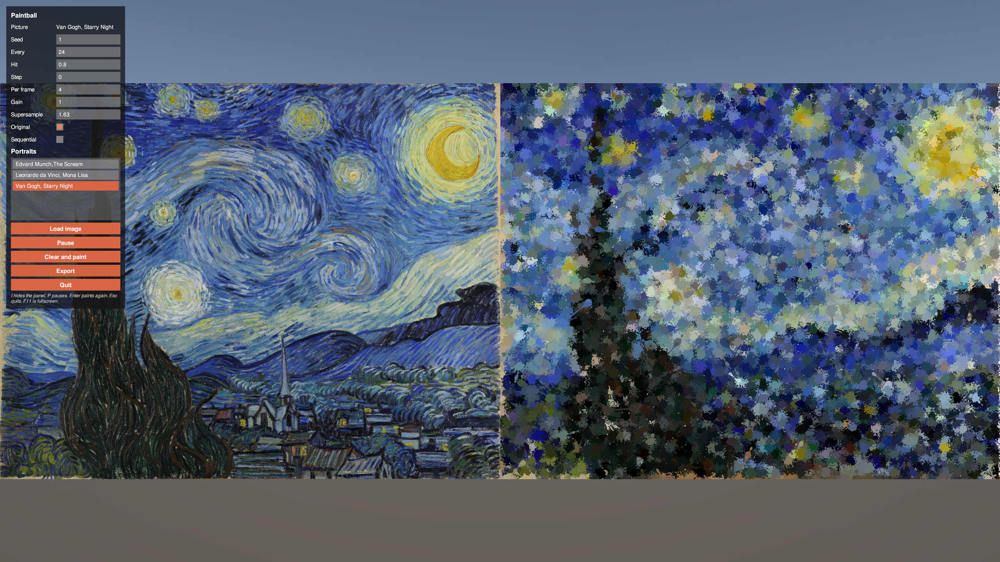

# Paintball Portrait

Add `PaintballPortrait` to any GameObject and press play. A canvas is primed linen and then hit by paintballs until the picture comes back. `showOriginal` puts the source on the left and the canvas on the right; off, the canvas fills the screen. `sequential` fires across each row from the bottom; off, the same shots land in a random order from the seed.

The picture is read into one flat array (`x + y * width`, y up). Every Nth pixel across and down is a shot: that index is where it lands, and the pixel's colour is the paintball. N is `sampleEvery`. A plain stride along the strip would only thin the columns, so the step is taken in both directions and the flat index is `x + y * width`. With no texture assigned, a small stand-in face is used. To aim a real picture (the Mona Lisa is the one this experiment is known for), assign a Texture2D with Read/Write enabled, Non-Power of Two set to None, and Max Size at least as large as the picture. Otherwise Unity resamples the import and the ratio changes before the first shot.

`hit` is the core radius as a fraction of the gap between samples. Near 0.45 the bursts meet. `shotsPerFrame` caps how many land in one frame; `paintStep` waits between them (0 does not wait). A large picture at a small N is a long volley: raise N.

Exported paintings:

`PaintballPortraitControls` on the same GameObject opens a panel in play mode with every setting, and a button that clears the canvas and paints again. The list is the pictures in `Assets/Resources/PaintballPortraits`. Those ship with a player build. In the editor the list also includes other png and jpeg files at least 256 px on the long side, and picking one fixes Read/Write, Non-Power of Two None, and Max Size, then paints. Load image in the editor copies a file into that folder. Load image in a build reads a png or jpeg from disk and adds it to the list. Export asks where to save the canvas as a PNG. Pause holds the volley where it is, and Resume continues from the next paintball. Hover a setting for what it does. Press I to hide or show the panel. Press P to pause or continue. Press Enter to clear the canvas and paint again. Escape quits, and F11 toggles fullscreen. Windowed, the window is half the monitor's width and half its height.
